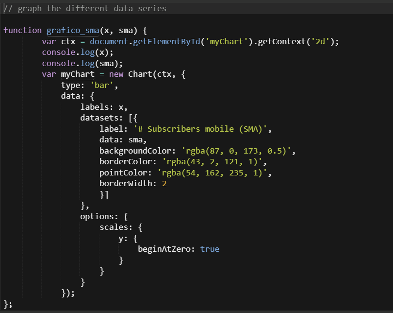
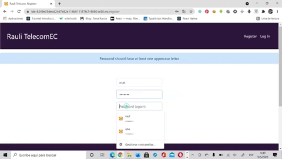
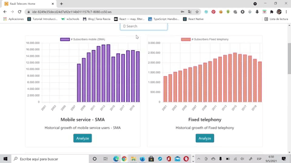
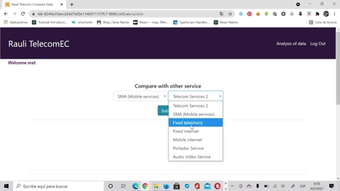
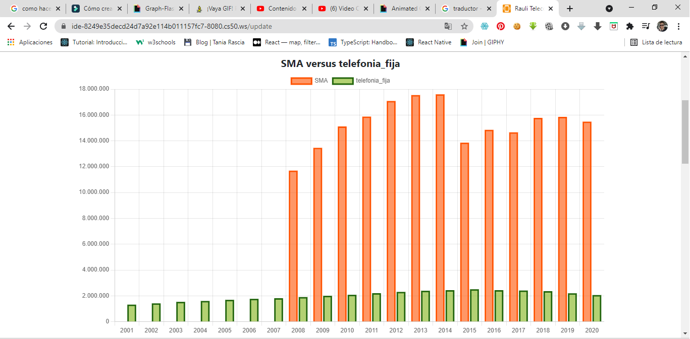
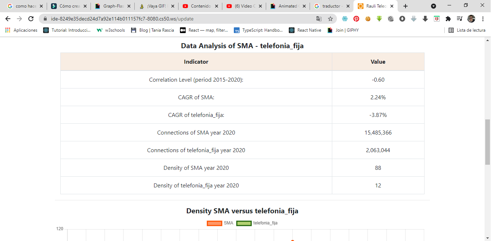
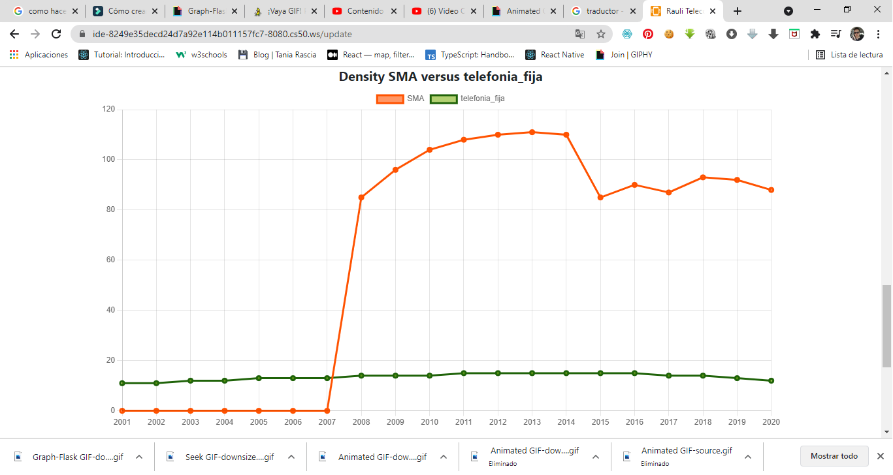

# Ecuador-Telecommunications-Webb-App

## CS50
This is the final project to the CS50 Introduction to Computer Sciense course.
Ecuador Telecommunications Web App, is an app built in python, flask, Flask-SQLAlchemy and javascript.
It is a web app that shows data on telecommunications in Ecuador.

## Demonstration on youtube
For the final project of CS50 I have made a video showing my project,
[My Final Project presentation](https://www.youtube.com/watch?v=3X1o_MGgP_g)

## Features
For the construction of this web app, the Flask framework based on python has been used, the flask-sqlalchemy
for manage SQL database with sqlite and javascript for managing the data in the fronted.

- [Flask](https://flask.palletsprojects.com/en/1.1.x/)
- [Flask-SQLAlchemy](https://flask-sqlalchemy.palletsprojects.com/en/2.x/)
- [Chart.js](https://www.chartjs.org/docs/latest/)
- [JavaScript](https://www.w3schools.com/js/default.asp)

I've used Flask web framework based in Python.
Its was necessary flask-sqlalchemy for manage SQL database with sqlite.
JavaScript was used to process the different data series and obtain the different graphs of the
telecommunications services.

## Explaining the project and the database
My final project is a web app that allows the user who has registered to access information on
telecommunications services in Ecuador.

This web app allows you to analyze the data of the different telecommunications services that
exist in Ecuador, calculating the correlation between two services, calculating the compound annual growth rates (CAGR),
service densities, and the number of connections in the last year.

Currently, the institution that regulates telecommunications in Ecuador (ARCOTEL) manages the information in excel files,
for which this application would allow to modernize the management of information and allow better decision-making.

### Sqlachemy and sqlite3:
I needed two tables for my database (telecoec.db):
- First, table users. In which the users who access this web app are registered.
- Second table, table services. In which the statistical information of the main services installed in Ecuador was stored.

### Login and Register
For login wraps is imported in which the user_id is verified (login.py file)
For the register, it was configured so that the password has a length of at least 4 characters, has at least one number and
has at least one uppercase letter (application.py).

### Get the different data series
Through the Flask framework, the services table was accessed, and the different data series of the different services
were obtained. With that series of data we proceeded to graph with javascript.

```python
        sma = []
        fixed_phone = []
        fixed_internet = []
        mobile_internet = []
        portador_enlaces = []
        audio_video = []

        for i in range(len(data)):
            x.append(data[i]["Fecha"])
            sma.append(data[i]["SMA"])
            fixed_phone.append(data[i]["telefonia_fija"])
            fixed_internet.append(data[i]["Internet_Fijo"])
            mobile_internet.append(data[i]["Internet_Movil"])
            portador_enlaces.append(data[i]["Portadores_Enlaces"])
            audio_video.append(data[i]["AVS"])

```
In javascript it is graphed with the following code (index.js). Chart.js is used.

| Code to graph telecommunications services |
| :---: |
|   |

### Analysis of data
Numpy corrcoef was used to calculate the correlation, using data from the last five years.
```python
r = np.corrcoef(datos1[15:20], datos2[15:20])
correlacion = r[0, 1]
```
To obtain the compound annual growth rate (CAGR), the economic formula established for this
indicator was used. The CAGR was calculated for the data in the period (2015 - 2020).

```python
tacc_datos1 = (((datos1[19]/datos1[14])**0.2) - 1) * 100
tacc_datos2 = (((datos2[19]/datos2[14])**0.2) - 1) * 100
```
The density indicator was calculated with the historical information of the connection data
of the different services and with the population information.

```python
for i in range(len(data1)):
    density = round((data1[i][service1]/data1[i]["POBLACION"]) *100)
    historic_density1.append(density)

for i in range(len(data2)):
    density = round((data2[i][service2]/data1[i]["POBLACION"]) *100)
    historic_density2.append(density)
```
To graph the two telecommunications services analyzed, use javascript (update.js). Chart.js is used.

### Pictures
- Register, Login and Search services

| Register and Login | Search services |
| :---: | :---: |
|   | |

- Analysis of the services

| Comparison of two services | Result: Graph of the two services |
| :---: | :---: |
|   | |

| Results: Correlation, CAGR, Density | Result: Graph of the Density |
| :---: | :---: |
|   | |

### Note
I thought to carry out this project with the React framework as fronted but due to the weight of the files and the limit
that the final project should have, I decided on python, flask, Flask-SQLAlchemy and javascript.
An API was not used as this information has never been processed. There is no API for telecommunications services in Ecuador
in the market.

## About CS50
CS50 is Harvard's computer science introduction.
Teacher: David J. Malan
Thank you for all CS50.

[Link CS50 course](https://www.edx.org/es/course/introduction-computer-science-harvardx-cs50x)

[LinkedIn Byron Raul Aviles Rodriguez](https://www.linkedin.com/in/raulaviles/)


